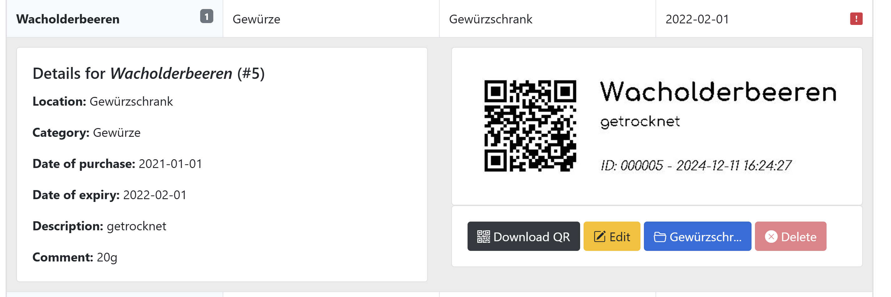
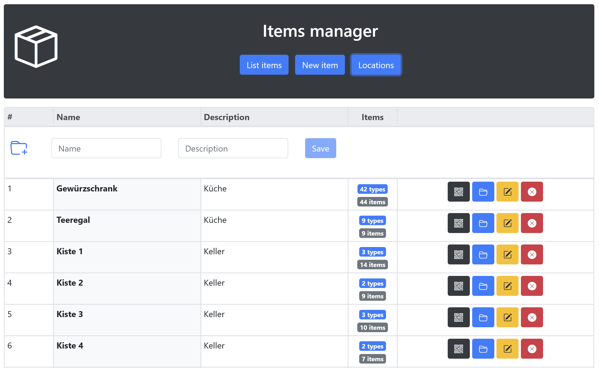

# item_manager
Simple label generator with CRUD-functions

## Backend

[Code](backend/src/main/java/com/itemmanager/)

The backend is programmed in Java and deployed through a docker image containing a DB (here MySQL) and listening on port 8080.

- Module Itemmanager: Springboot framework, gets GET and POST requests from client, elaborates the request and updates RDBM
- Module QRcode: Generates the QR code

## Frontend

[Code](client/src/)

The frontend is programmed in TypeScript, using AngularJS as a Framework. It's also deployed through a docker image (note: it would be possible to put front- and backend in the same image for ease of deployment)

# Screenshots

### Overview

### Overview with detail view

### Locations

### Item view

